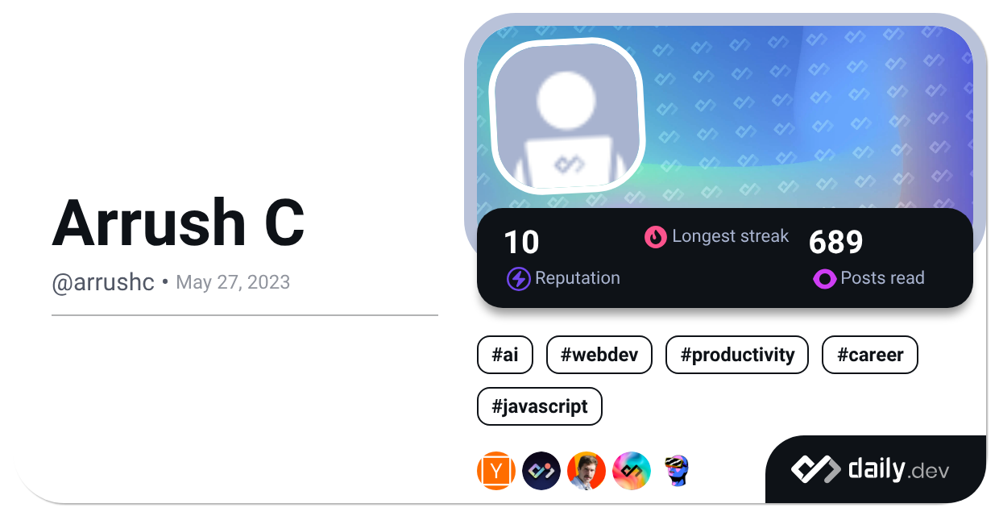

***

<h3 align="center">Hello, I'm Arrush 👋</h3>

***

<h4>📖 About Me</h4>

- 👨‍🎓 I'm a recent graduate from the University of Bath with a **BSc (Hons.) Computer Science** degree.
- 🏋️‍♂️ My hobbies include: Programming, Swimming, Reading, Researching & Learning.
- 💻 I have been programming since 2014 and have built a broad range of projects covering many areas of Computer Science & Engineering. You may find them through the repository tab on this site or on my website!

<h4>📈 My Stats</h4>

  

  
  

***

<h3 align="center">Thank you for reading! For contact details, please see the below section 😄</h3>

***

<h4>💬 Contact Me</h4>

- 🏪 GitHub: `https://github.com/ArrushC` (You are here!)
- 💬 Discord: `arrushc`
- 📧 Email: `contact@arrushc.com`
